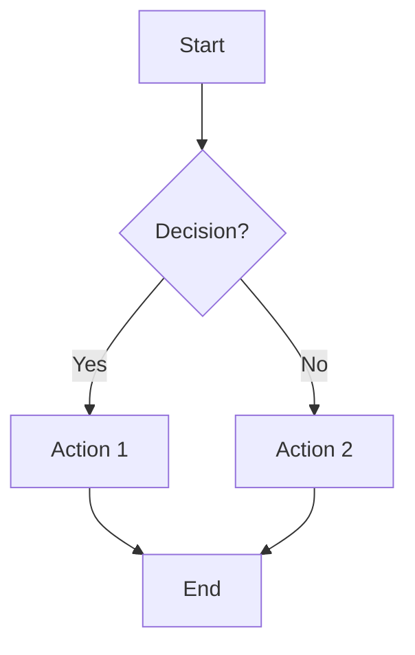
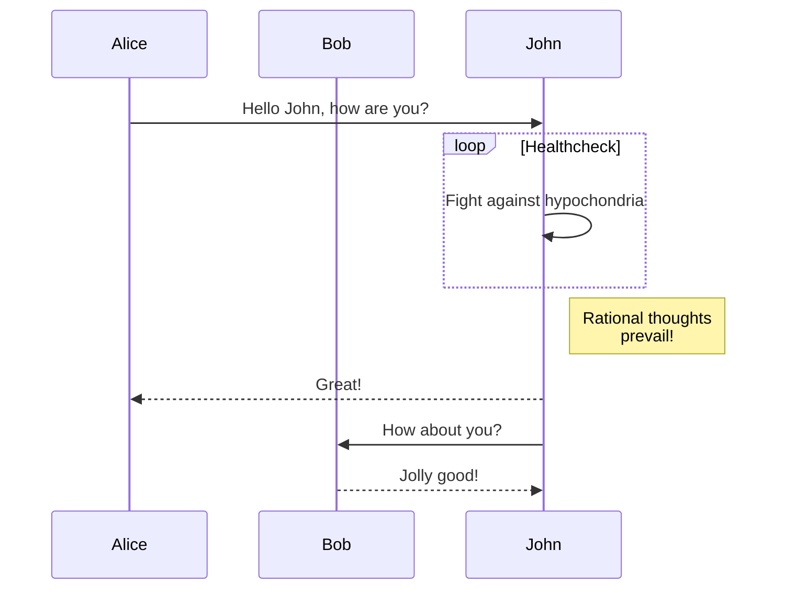
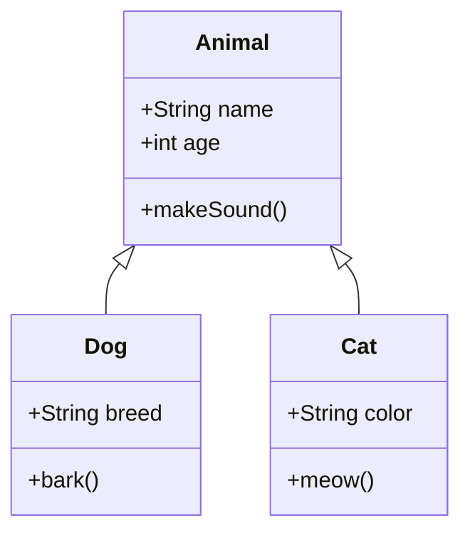
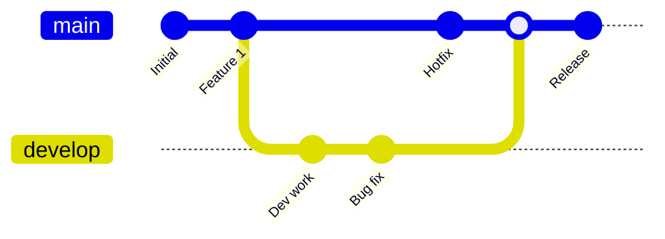
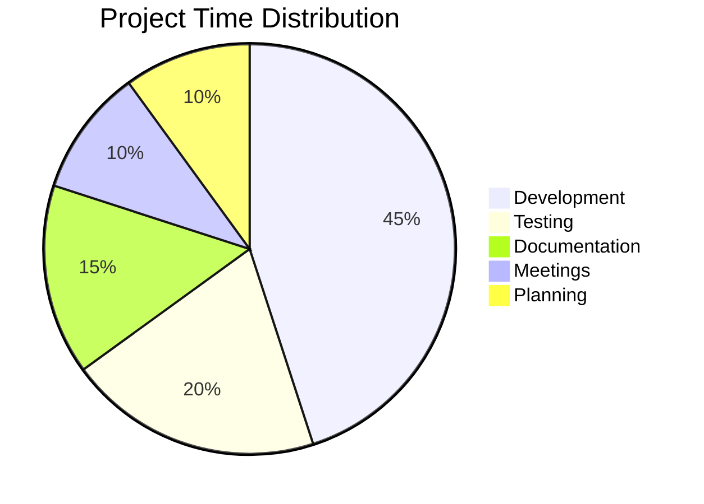
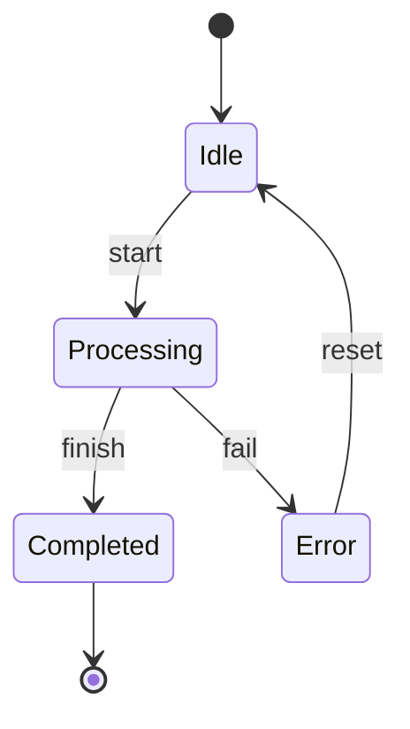
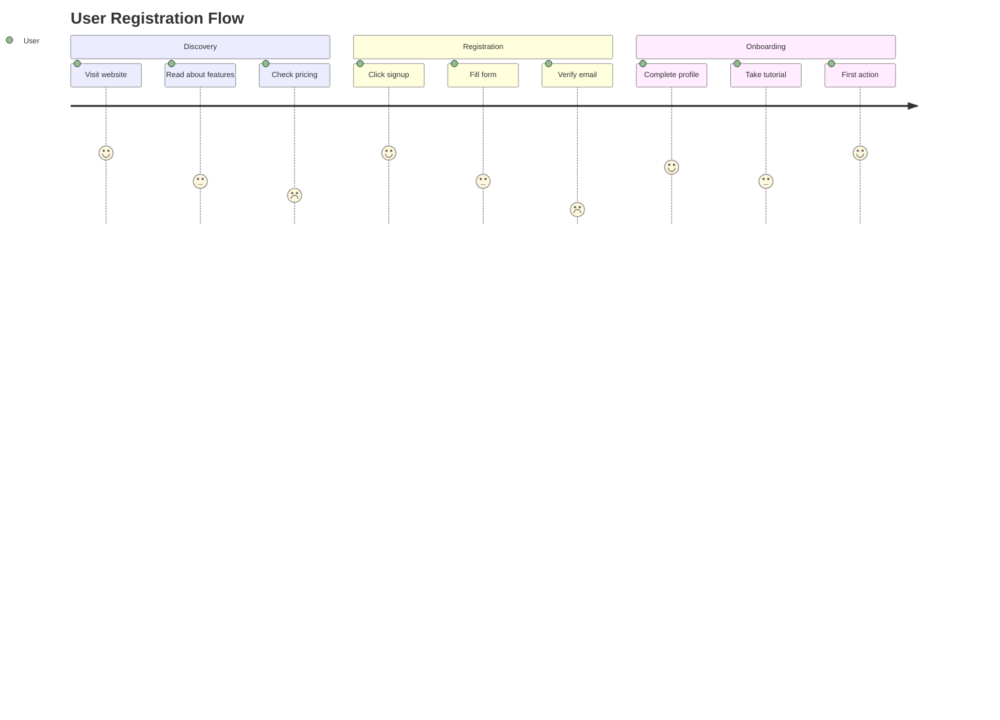

# Sample Mermaid Diagrams

This page demonstrates various Mermaid diagram types available in your scrapbook.

## Flowchart



### Flowchart Markup
```markdown
graph TD;
    A[Start] --> B{Decision?};
    B -->|Yes| C[Action 1];
    B -->|No| D[Action 2];
    C --> E[End];
    D --> E[End];
```

## Sequence Diagram



### Sequence Diagram Markup
```markdown
sequenceDiagram
    participant Alice
    participant Bob
    Alice->>John: Hello John, how are you?
    loop Healthcheck
        John->>John: Fight against hypochondria
    end
    Note right of John: Rational thoughts <br/>prevail!
    John-->>Alice: Great!
    John->>Bob: How about you?
    Bob-->>John: Jolly good!
```

## Class Diagram



### Class Diagram Markup
```markdown
classDiagram
    class Animal {
        +String name
        +int age
        +makeSound()
    }
    
    class Dog {
        +String breed
        +bark()
    }
    
    class Cat {
        +String color
        +meow()
    }
    
    Animal <|-- Dog
    Animal <|-- Cat
```

## Git Graph



### Git Graph Markup
```markdown
gitGraph
    commit id: "Initial"
    commit id: "Feature 1"
    branch develop
    checkout develop
    commit id: "Dev work"
    commit id: "Bug fix"
    checkout main
    commit id: "Hotfix"
    merge develop
    commit id: "Release"
```

## Pie Chart



### Pie Chart Markup
```markdown
pie title Project Time Distribution
    "Development" : 45
    "Testing" : 20
    "Documentation" : 15
    "Meetings" : 10
    "Planning" : 10
```

## State Diagram



### State Diagram Markup
```markdown
stateDiagram-v2
    [*] --> Idle
    Idle --> Processing : start
    Processing --> Completed : finish
    Processing --> Error : fail
    Error --> Idle : reset
    Completed --> [*]
```

## User Journey



### User Journey Markup
```markdown
journey
    title User Registration Flow
    section Discovery
      Visit website: 5: User
      Read about features: 3: User
      Check pricing: 2: User
    section Registration
      Click signup: 5: User
      Fill form: 3: User
      Verify email: 1: User
    section Onboarding
      Complete profile: 4: User
      Take tutorial: 3: User
      First action: 5: User
```
