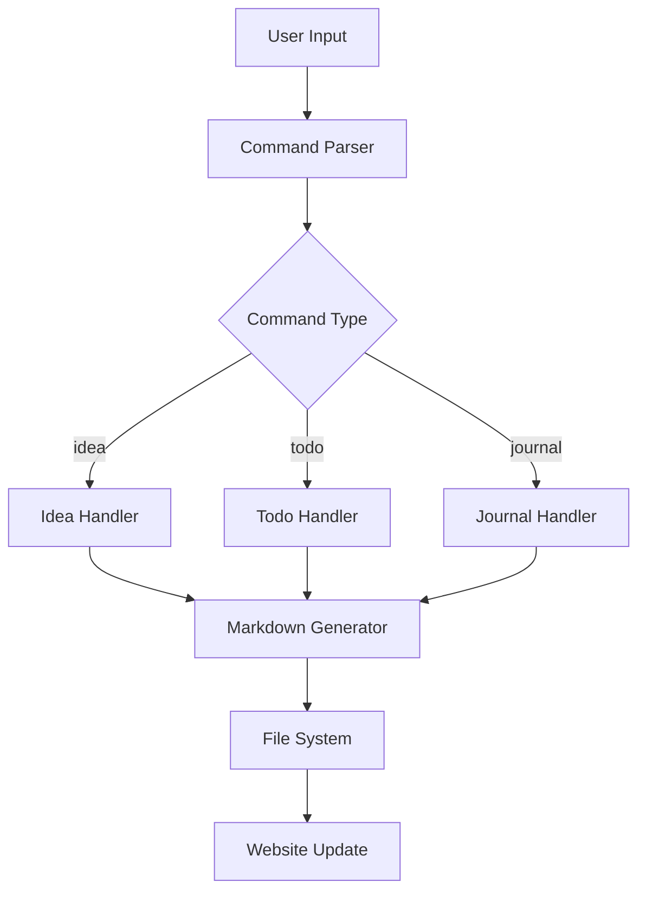

# Create Diagram

**Description**: Generate Mermaid diagrams for visual documentation  
**Allowed Tools**: Bash, Write, Python CLI

## Instructions

1. **Analyze conversation for diagram needs**
2. **Choose appropriate Mermaid diagram type**
3. **Create diagram content with proper syntax**
4. **Save to diagrams directory**
5. **Add diagram reference to scrapbook**

## Implementation Steps

1. Identify diagram type needed:
   - **flowchart**: Process flows, decision trees
   - **sequenceDiagram**: API interactions, workflows
   - **classDiagram**: Object relationships, data models
   - **gitgraph**: Branch strategies, release flows
   - **gantt**: Project timelines, milestones
   - **erDiagram**: Database schemas, entity relationships

2. Extract diagram content from conversation context

3. Create Mermaid diagram file:
   ```bash
   # Generate filename from title
   DIAGRAM_TITLE="System Architecture"
   FILENAME=$(echo "$DIAGRAM_TITLE" | tr ' ' '-' | tr '[:upper:]' '[:lower:]').md
   
   # Create diagram file (adjust path as needed)
   cat > "diagrams/$FILENAME" << 'EOF'
   ---
   title: [Diagram Title]
   ---
   
   # [Diagram Title]
   
   [Brief description of what the diagram shows]
   
   ```mermaid
   [mermaid diagram content]
   ```
   
   ## Notes
   - [Additional context or explanations]
   EOF
   ```

4. Add to scrapbook index:
   ```bash
   scrap workflow "Created diagram: $DIAGRAM_TITLE" "Added new Mermaid diagram: $FILENAME

   Location: /diagrams/$FILENAME
   Type: [diagram type]
   Purpose: [brief description]" --category="documentation" --tags="diagram,mermaid,visual"
   ```

5. Verify diagram creation:
   ```bash
   echo "Diagram created: /docs/diagrams/$FILENAME"
   ls -la "website/docs/diagrams/$FILENAME"
   ```

## Example Usage

System architecture flowchart:
```bash
FILENAME="cli-architecture.md"
cat > "diagrams/$FILENAME" << 'EOF'
---
title: CLI Architecture
---

# CLI Architecture

High-level overview of the CLI tool's internal structure and data flow.



## Notes
- All handlers validate input before processing
- Markdown files are automatically categorized
EOF

scrap workflow "Created CLI Architecture Diagram" "Added system architecture flowchart showing CLI internal structure." --category="documentation" --tags="diagram,architecture,cli,flowchart"
```