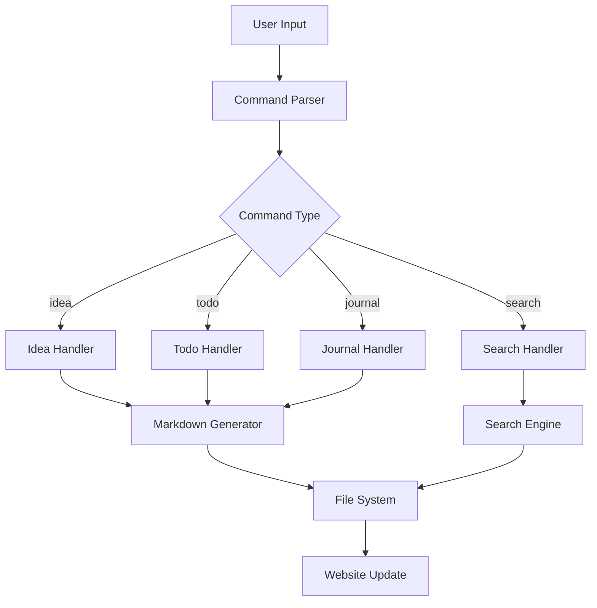
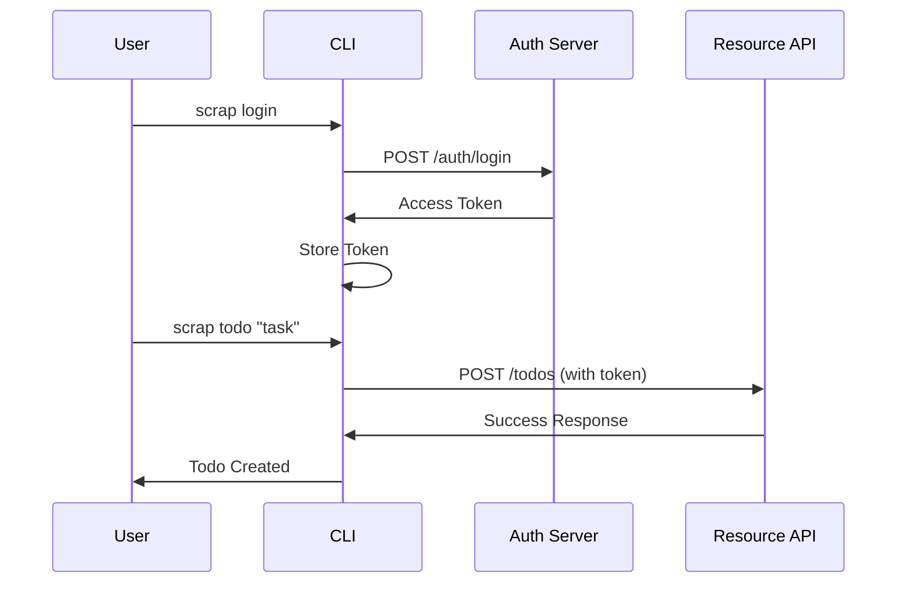
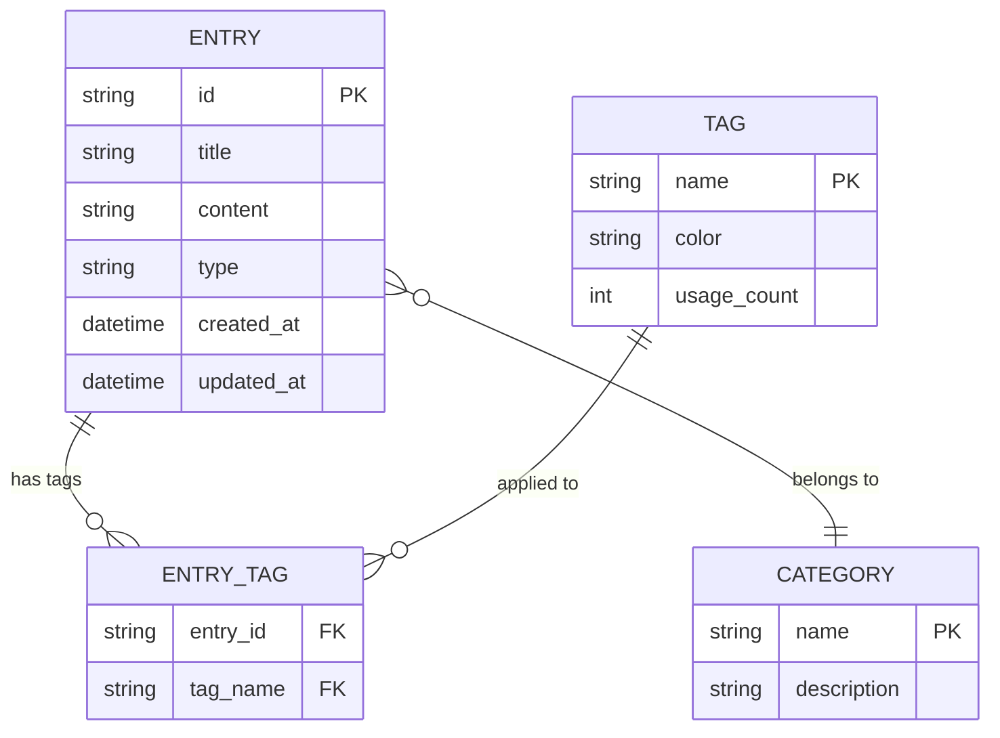

# Create Diagram

**Description**: Generate Mermaid diagrams for visual documentation  
**Allowed Tools**: create_file, run_in_terminal

## Instructions

1. **Analyze conversation for diagram needs**
2. **Choose appropriate Mermaid diagram type**
3. **Create diagram content with proper syntax**
4. **Save to diagrams directory**
5. **Add diagram reference to scrapbook**
6. **Verify rendering**

## Implementation Steps

1. Identify diagram type needed:
   - **flowchart**: Process flows, decision trees
   - **sequenceDiagram**: API interactions, workflows
   - **classDiagram**: Object relationships, data models
   - **gitgraph**: Branch strategies, release flows
   - **gantt**: Project timelines, milestones
   - **erDiagram**: Database schemas, entity relationships

2. Extract diagram content from conversation:
   - System components and relationships
   - Process steps and decision points
   - Data flow and interactions
   - Timeline or sequence information

3. Create Mermaid diagram file:
   ```bash
   # Generate filename from title
   DIAGRAM_TITLE="System Architecture"
   FILENAME=$(echo "$DIAGRAM_TITLE" | tr ' ' '-' | tr '[:upper:]' '[:lower:]').md
   
   # Create diagram file
   cat > "/home/mattpc/HueTesting/scrapbook-md/website/docs/diagrams/$FILENAME" << 'EOF'
   ---
   title: [Diagram Title]
   ---
   
   # [Diagram Title]
   
   [Brief description of what the diagram shows]
   
   ```mermaid
   [mermaid diagram content]
   ```
   
   ## Notes
   - [Additional context or explanations]
   EOF
   ```

4. Add to scrapbook index:
   ```bash
   cd /home/mattpc/HueTesting/scrapbook-md
   ./scrap workflow "Created diagram: $DIAGRAM_TITLE" "Added new Mermaid diagram: $FILENAME
   
   Location: /docs/diagrams/$FILENAME
   Type: [diagram type]
   Purpose: [brief description]" --category="documentation" --tags="diagram,mermaid,visual"
   ```

5. Verify diagram renders correctly:
   ```bash
   echo "Diagram created: /docs/diagrams/$FILENAME"
   echo "View at: http://localhost:3000/docs/diagrams/$(basename $FILENAME .md)"
   ```

## Example Usage

System architecture flowchart:
```bash
cat > "/home/mattpc/HueTesting/scrapbook-md/website/docs/diagrams/cli-architecture.md" << 'EOF'
---
title: Scrapbook CLI Architecture
---

# Scrapbook CLI Architecture

High-level overview of the CLI tool's internal structure and data flow.



## Notes
- All handlers validate input before processing
- Markdown files are automatically categorized
- Search engine indexes all content types
- Website rebuilds automatically detect new content
EOF

./scrap workflow "Created CLI Architecture Diagram" "Added system architecture flowchart showing CLI internal structure.

Location: /docs/diagrams/cli-architecture.md
Type: flowchart
Purpose: Visualize how CLI commands flow through the system" --category="documentation" --tags="diagram,architecture,cli,flowchart"
```

API sequence diagram:
```bash
cat > "/home/mattpc/HueTesting/scrapbook-md/website/docs/diagrams/auth-flow.md" << 'EOF'
---
title: Authentication Flow
---

# Authentication Flow

Sequence diagram showing the authentication process for API access.



## Notes
- Tokens are stored securely in user config
- Automatic token refresh handled by CLI
- All API calls include authentication headers
EOF
```

Database entity diagram:
```bash
cat > "/home/mattpc/HueTesting/scrapbook-md/website/docs/diagrams/data-model.md" << 'EOF'
---
title: Data Model
---

# Scrapbook Data Model

Entity relationship diagram showing the data structure.



## Notes
- Entries can have multiple tags
- Categories are predefined (ideas, todos, etc.)
- Tag usage count helps with auto-suggestions
EOF
```

## Diagram Types

1. **flowchart**: Decision trees, process flows, system architecture
2. **sequenceDiagram**: API interactions, user workflows, communication
3. **classDiagram**: Object models, inheritance, relationships
4. **erDiagram**: Database schemas, data relationships
5. **gantt**: Project timelines, milestones, schedules
6. **gitgraph**: Branch strategies, release flows

## Best Practices

- Include descriptive titles and descriptions
- Add notes to explain complex relationships
- Use consistent naming conventions
- Keep diagrams focused on single concepts
- Test rendering in Docusaurus before committing
- Reference diagrams from related documentation
